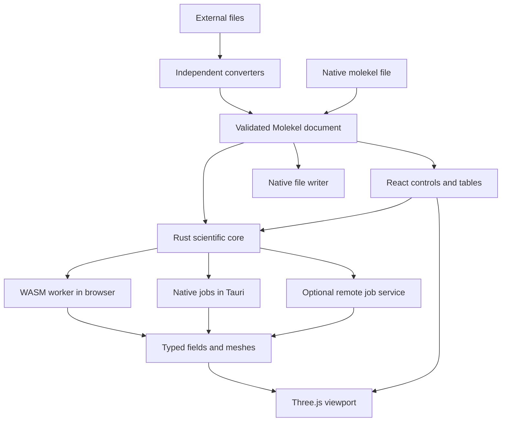

# Molekel language and framework decision

Decision: use a TypeScript/React/Three.js application shared between browser and Tauri 2 on macOS, with Rust for the scientific document model, job management, and numerical coordination. Use existing scientific C implementations for Gaussian evaluation and MC33 extraction where validated. Keep a native `.molekel` format at the boundary between converters and the application.

This selects the architecture now. Small implementation experiments remain necessary to validate dependencies, runtime limits, and the most difficult graphics paths. They are described in the [delivery plan](07-validation-and-delivery.md), not claimed as completed work.

## Why this fits

The application needs tables, file handling, scientific controls, and a viewport that can show molecules, arbitrary OBJ meshes, sampled fields, and analytic fields together. The shared web interface reduces duplicated UI work between desktop and browser. A separately testable numerical core prevents UI or graphics choices from defining scientific semantics.

Use **Three.js WebGLRenderer with WebGL2 for the initial renderer**. Implement the required volume and analytic raycasting passes behind a rendering interface. WebGL2 already supports the shader/3D-texture approach needed here; compute shaders are not required to deliver those modes. Three.js supplies [instanced geometry](https://threejs.org/docs/pages/InstancedMesh.html), an [OBJ loader](https://threejs.org/docs/pages/OBJLoader.html), and a [volume rendering example](https://threejs.org/examples/webgl_texture3d.html). These establish useful building blocks, not a finished scientific renderer.

Evaluate Three.js WebGPURenderer and its WebGL2 backend after the first representative scenes. Its [documented fallback](https://threejs.org/docs/pages/WebGPURenderer.html) is real, but that does not make existing GLSL ShaderMaterial code portable to its node-material path. Budget a deliberate shader/material migration. Do not maintain two complete production renderers at the outset.

## Options compared

Scores are design judgments, 1 weak to 5 strong for this project. They are not benchmark results. Weights: shared desktop/browser implementation 25%, scientific reuse 20%, custom rendering control 20%, delivery simplicity 20%, and offline/local operation 15%.

| Option | Shared targets | Scientific reuse | Rendering control | Simplicity | Offline | Weighted score |
| --- | ---: | ---: | ---: | ---: | ---: | ---: |
| Shared web UI, Rust core, Tauri, optional compute service | 5 | 4 | 4 | 4 | 5 | 4.40 |
| Web client with mandatory computation server | 4 | 5 | 4 | 3 | 1 | 3.55 |
| Tauri UI with Bevy/wgpu rendering | 3 | 3 | 5 | 2 | 5 | 3.50 |
| C++/Qt/VTK with custom Vulkan/MoltenVK renderer | 2 | 5 | 4 | 2 | 5 | 3.45 |
| SwiftUI/AppKit with Metal | 1 | 3 | 5 | 3 | 5 | 3.20 |

The first row adds native packaging to the full-web option while keeping remote computation optional. If browser use is dropped and a native graphics specialist is available, Swift/Metal or Rust/wgpu becomes more attractive. If very large remote datasets dominate real use, the server option should be revisited.

### Full web client and server

A server can use PySCF, cclib, VTK, or native kernels, and cache results for expensive repeated jobs. It also adds uploads, waiting, service maintenance, and storage ownership to ordinary use. Send compact meshes when the client only needs a surface; send chunked scalar data when transfer functions or raycasting must remain interactive. Sending only a rendered image gives a different, remote-visualization product.

Recommendation: static web hosting plus local workers first. Add an optional service through the same job contract when a measured workload exceeds browser resources. Remote file transfer is a visible user action.

### Tauri with Rust and Bevy

[wgpu](https://docs.rs/wgpu/latest/wgpu/) supports native Metal and other backends and browser graphics paths. [Bevy's WebGPU examples](https://bevy.org/examples-webgpu/) demonstrate a viable browser target. A Tauri webview and a native Bevy/wgpu surface, however, are different rendering surfaces; embedding and synchronizing them would be project work. Compiling Bevy to the web is another deployment configuration.

Bevy's scene and game-engine systems do not supply the needed quantum chemistry model, desktop tables, or import conventions. It is a credible choice for a Rust-first graphics team, but adds integration work to this UI-heavy scientific tool. If native Rust graphics becomes essential, assess a direct wgpu viewport before adding Bevy.

### C++ with Qt and VTK

Modern VTK offers valuable mesh and volume algorithms. A Qt 6/VTK modernization is credible if preserving the desktop workflow outweighs browser sharing. It still requires removing or replacing the old OpenMOIV bridge and old graphics calls.

Qt's [graphics abstraction](https://doc.qt.io/qt-6/qrhi.html) supports several APIs, including Metal and Vulkan. That does not switch VTK's renderers to the same backend. The reviewed [VTK WebGPU module documentation](https://docs.vtk.org/en/latest/modules/vtk-modules/Rendering/WebGPU/README.html) lists volume mappers and dual-depth peeling as future work. It cannot be assumed to cover this brief by changing a build flag.

[MoltenVK](https://github.com/KhronosGroup/MoltenVK) maps a Vulkan portability subset to Metal. It translates Vulkan work, not old OpenGL or VTK code. Rewriting the renderer in Vulkan while retaining VTK algorithms is possible, but it is a substantially larger graphics project than a toolkit update.

### macOS frameworks only

SwiftUI/AppKit, MetalKit, Metal, and Accelerate would provide a direct macOS implementation. [Metal](https://developer.apple.com/metal/) provides graphics and compute facilities; molecular semantics, meshing, and importers would still need implementation or integration. A strict Apple-frameworks-only rule also excludes many useful scientific libraries.

This would be a good choice for a Mac-only product with significant native graphics investment. It duplicates most interface and rendering work if a browser application follows, so it is not the recommendation for the current brief.

## Existing viewer alternatives

| Candidate | Evidence and fit | Decision |
| --- | --- | --- |
| Mol* | Has molecular representations, volumes, and actual orbital/density extensions; not merely a protein viewer | Strong benchmark and possible alternative renderer |
| 3Dmol.js | Existing WebGL molecular viewer with documented source and examples | Useful if molecular display dominates and custom field passes remain limited |
| vtk.js | Scientific volume rendering and image marching cubes | Strong alternative when sampled-volume operations dominate |
| Three.js | General scene graph, meshes, instancing, custom shader passes, OBJ | Selected for control over the combined molecular/OBJ/analytic-field viewport |

Mol* was examined beyond its home page: the [orbital extension](https://raw.githubusercontent.com/molstar/molstar/master/src/extensions/alpha-orbitals/orbitals.ts) has CPU/GPU evaluation paths. Its [basis model](https://raw.githubusercontent.com/molstar/molstar/master/src/extensions/alpha-orbitals/data-model.ts) is spherical and notes a general-contraction limitation; its [density path](https://raw.githubusercontent.com/molstar/molstar/master/src/extensions/alpha-orbitals/density.ts) requires a GPU capability. These are limitations of the inspected extension, not a claim that Mol* cannot be extended. The project still needs convention normalization and numerical validation whichever viewer is chosen.

The Three.js choice incurs explicit work: molecular bond geometry, scientific transfer functions, mixed transparency, root finding, and robust picking. If the graphics experiment cannot meet the acceptance scenes within the agreed effort budget, switch the viewport adapter to Mol* or vtk.js before building the full UI. Do not run multiple scene engines in the same viewport by default.

## Component boundaries

The arrows express logical dependencies, not a requirement to copy every array between every component. Transfer ownership of large buffers and use bounded chunks.

| Component | Responsibility | Must not own |
| --- | --- | --- |
| Document/core | Units, basis/field identities, validation, immutable arrays | Camera, DOM, GPU objects |
| Converter | Source parsing, convention conversion, loss report, provenance | Rendering or guessed missing scientific data |
| Evaluator | Field values/gradients, density contraction, sample grids | Global current orbital or UI state |
| Mesher | Indexed geometry from a field and algorithm settings | Atom colors or camera |
| Renderer | GPU resources, materials, visibility, picking, camera | Authoritative coefficients or occupation interpretation |
| Job manager | Progress, cancellation, cache, concurrency and memory budget | Scientific defaults hidden from document provenance |
| Desktop adapter | File dialogs, native storage, worker execution, packaging | A second independent science implementation |

## Language and dependency choices

- TypeScript and React: interface, tables, document presentation, and graphics integration. Keep the Three.js render loop independent of React component updates.
- Rust: shared document validation, binary arrays, job descriptions, cache keys, and native/WASM coordination. Reference calculations use f64; GPU arrays are derived f32 data.
- C scientific libraries: first candidates are [gau2grid](https://github.com/psi4/gau2grid) for Gaussian values/derivatives and [MC33](https://github.com/dvega68/MC33_c_library) for meshing. Native and WASM builds, normalization adapters, cancellation granularity, and licenses need verification before pinning.
- Python: independent reference data and later converters using PySCF/cclib. Do not require a Python installation to open a `.molekel` document in the initial viewer.

Rust plus C/WASM integration is a material risk. Prefer the same C kernels behind Rust wrappers in both targets, with scalar compilation first and optional SIMD after validation. If library linking requires excessive toolchain work, a separate C/WASM module with the same binary job interface is the fallback. Keep that choice below the document and UI contracts.

## Jobs and cache

A job specifies document revision, scientific content hash, requested field, domain/grid, method, precision, tolerances, algorithm version, and budget. Its states are queued, running, completed, cancelled, and failed. Only complete validated artifacts enter the cache. Each response carries a request generation so an old result cannot replace a newer selection.

Use a field cache separate from a mesh cache. Changing isovalue reuses the grid; changing color only updates material; changing basis, coefficients, units, occupations, or domain invalidates the appropriate scientific result. Cache keys exclude camera state but include any value that changes results. Hash normalized metadata plus original-precision array bytes using a specified canonical serialization, not ad hoc JSON object order.

The browser uses workers with a single-threaded baseline. Shared-memory threading is an enhancement requiring its own deployment and runtime checks. The desktop can schedule native threads. A synchronous WASM calculation must be split into bounded work units so cancellation messages can be processed; otherwise terminate its isolated worker and discard its uncommitted result.

An optional server exposes submit/status/cancel/result operations and streams binary chunks with checksums. Cache isolation, authentication, deletion, and retention become server requirements when that deployment is built. They are unnecessary infrastructure for the first local viewer.

## macOS and browser compatibility

Tauri uses the system [WKWebView on macOS](https://v2.tauri.app/reference/webview-versions/). The system webview must be tested in the packaged application. Safari tests alone are insufficient. WebKit announced WebGPU in [Safari 26](https://webkit.org/blog/17333/webkit-features-in-safari-26-0/), but that does not establish every supported OS, device, or packaged webview configuration.

At startup, probe texture dimensions, float sampling/filtering, render-target support, and context/device creation. Use manual trilinear interpolation if the chosen float format cannot be filtered. Display capability failures precisely. Minimum OS and browser versions are fixed only after the first packaged compatibility tests.

## Decision consequences

The native data model and converters can survive a renderer change. The cost is maintaining a TypeScript/Rust boundary and possibly C kernels. The highest-risk work is scientific convention conversion and combined transparent surfaces/volumes, not the application shell. Put those experiments before polished interface work.
